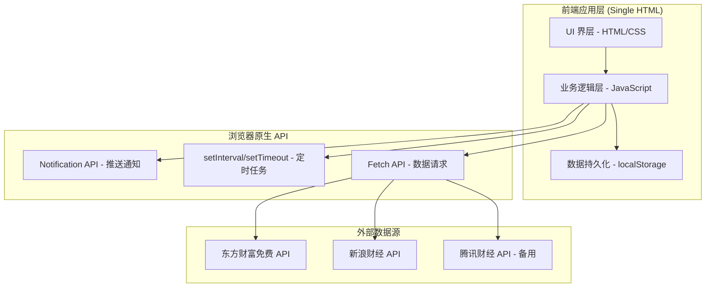
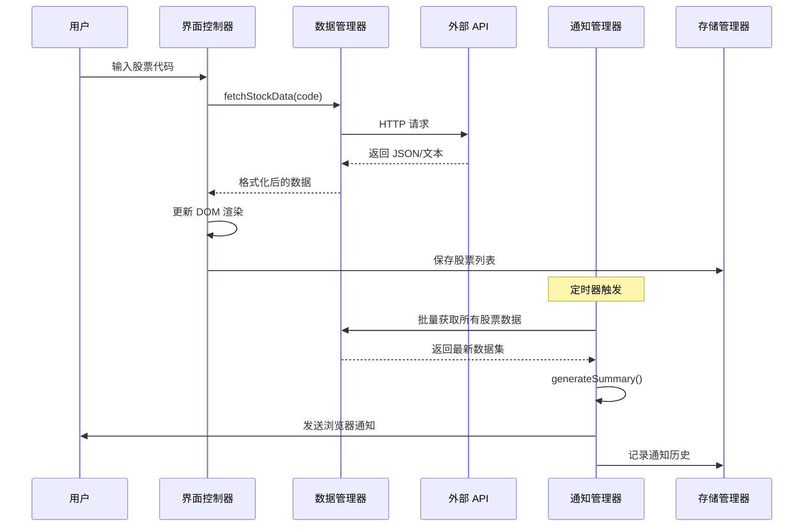

# 本地股票分析提醒系统 - 技术架构文档

## 1. 架构设计



## 2. 技术选型

### 2.1 前端技术栈
- **标记语言**: HTML5 (语义化标签)
- **样式方案**: CSS3 (自定义属性、Grid/Flexbox、动画)
- **脚本语言**: Vanilla JavaScript (ES6+)
- **构建工具**: 无需构建，单文件直接运行
- **字体资源**: Google Fonts (Space Grotesk + DM Sans)

### 2.2 数据源方案
| 数据源 | 用途 | 特点 |
|--------|------|------|
| 东方财富 Push2 接口 | 实时行情数据 | 免费、无需 Token、数据全面 |
| 新浪财经接口 | 备用行情源 | 稳定、历史悠久 |
| 腾讯财经接口 | 兜底备用 | 格式清晰 |

### 2.3 数据存储方案
- **主要存储**: `localStorage` (股票列表、用户设置)
- **会话存储**: `sessionStorage` (临时数据、缓存)
- **存储结构**:
  ```javascript
  {
    stockList: ['600519', '000001', 'hk00700'],
    settings: {
      notifyTime: '15:00',
      autoNotify: true,
      notifyEnabled: true
    },
    notificationHistory: [
      { time: '2026-05-29T15:00:00', content: '...' }
    ]
  }
  ```

## 3. 功能模块划分

### 3.1 核心类/模块
| 模块名 | 职责 | 关键方法 |
|--------|------|----------|
| StockDataManager | 股票数据获取与管理 | `fetchStockData()`, `parseResponse()`, `formatData()` |
| NotificationManager | 通知管理与调度 | `requestPermission()`, `scheduleNotify()`, `sendNotification()` |
| UIController | 界面渲染与交互 | `render()`, `bindEvents()`, `updateDisplay()` |
| StorageManager | 本地数据持久化 | `save()`, `load()`, `clear()` |
| AnalysisEngine | 简易分析逻辑 | `generateSummary()`, `calculateTrend()`, `assessRisk()` |

### 3.2 数据流架构


## 4. API 接口定义

### 4.1 行情数据接口
```typescript
// 请求: GET http://hq.sinajs.cn/list=sh600519
// 响应格式 (文本):
var hq_str_sh600519="贵州茅台,1800.50,1795.00,...";

// 解析后的数据结构:
interface StockData {
  code: string;           // 股票代码
  name: string;           // 股票名称
  currentPrice: number;   // 当前价
  yesterdayClose: number; // 昨收价
  openPrice: number;      // 今开价
  highPrice: number;      // 最高价
  lowPrice: number;       // 最低价
  volume: number;         // 成交量(手)
  turnover: number;       // 成交额
  changePercent: number;  // 涨跌幅(%)
  changeAmount: number;   // 涨跌额
}
```

### 4.2 错误处理策略
| 错误类型 | 处理方式 | 用户提示 |
|----------|----------|----------|
| 网络超时 | 重试 3 次、指数退避 | "网络连接失败，正在重试..." |
| 数据解析失败 | 切换备用数据源 | "数据源异常，已切换备用接口" |
| 无效股票代码 | 前端校验拦截 | "请输入正确的股票代码" |
| 通知权限被拒 | 引导用户开启 | "请允许通知权限以接收提醒" |

## 5. 安全性考虑

### 5.1 数据安全
- 所有数据仅存储在用户浏览器本地
- 不收集、上传任何用户信息
- 不使用 Cookie 或第三方追踪

### 5.2 接口安全
- 使用 JSONP 方式跨域获取公开数据
- 仅调用只读接口，不涉及用户资产
- 添加请求频率限制，避免被反爬

## 6. 性能优化策略

### 6.1 加载性能
- 字体使用 `font-display: swap` 避免阻塞
- CSS/JS 内联在单个 HTML 文件中
- 图片使用 SVG 内联或 data URI

### 6.2 运行时性能
- 数据请求合并，避免 N+1 问题
- 使用防抖(debounce)处理输入事件
- DOM 操作批量处理，减少重排重绘
- 定时器智能检查，避免空转浪费资源

### 6.3 缓存策略
- 行情数据缓存 30 秒，避免频繁请求
- 股票名称映射表缓存至 sessionStorage
- 静态资源利用浏览器缓存机制
