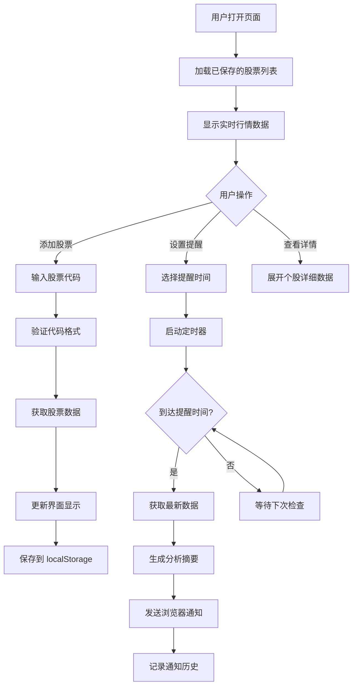

# 本地股票分析提醒系统 - 产品需求文档

## 1. 产品概述
一个基于浏览器的本地股票代码跟踪与每日自动提醒系统，灵感来源于 daily_stock_analysis 仓库的核心功能。用户可输入自选股票代码，系统会在每个交易日收盘后自动获取股票数据并通过浏览器推送通知，展示关键指标和简明分析。

- **目标用户**: 个人投资者、股票爱好者、需要日常跟踪特定股票的用户
- **核心价值**: 零配置、隐私安全（数据存储在本地）、自动化提醒、无需服务器

## 2. 核心功能

### 2.1 功能模块
1. **主控制面板**: 股票代码输入、列表管理、实时数据展示、提醒设置
2. **通知中心**: 历史通知记录、通知偏好设置
3. **数据分析面板**: 股票详情、技术指标、涨跌幅统计

### 2.2 页面功能详情
| 页面/模块 | 功能名称 | 功能描述 |
|-----------|----------|----------|
| 主控制面板 | 股票代码管理 | 输入框添加股票（支持 A 股代码如 600519）、删除、批量导入 |
| 主控制面板 | 实时行情展示 | 显示当前价格、涨跌幅、成交量、涨跌额 |
| 主控制面板 | 提醒时间设置 | 选择每日提醒时间（默认 15:00 收盘后） |
| 主控制面板 | 自动分析开关 | 启用/禁用每日自动分析提醒 |
| 数据分析面板 | 个股详情卡片 | 展示开盘价、最高价、最低价、昨收价、市值等 |
| 数据分析面板 | 技术指标摘要 | 简单的涨跌趋势判断、量比、换手率 |
| 通知中心 | 通知记录 | 显示历史推送的通知内容、时间戳 |
| 通知中心 | 通知测试 | 手动触发一次测试通知 |

## 3. 核心流程

## 4. 用户界面设计

### 4.1 设计风格
- **主色调**: 深色背景 (#0f172a) + 金融绿 (#10b981) 涨 / 金融红 (#ef4444) 跌
- **按钮风格**: 圆角胶囊状、渐变效果、悬停发光
- **字体**: 标题使用 'Space Grotesk'（技术感），正文使用 'DM Sans'
- **布局风格**: 卡片式布局、玻璃态效果 (glassmorphism)、响应式网格
- **图标风格**: 简洁线性图标、emoji 辅助表达

### 4.2 页面模块设计
| 模块名称 | UI 元素描述 |
|----------|-------------|
| 头部导航栏 | Logo + 标题、当前时间、通知权限状态指示器 |
| 股票输入区 | 大号输入框 + 添加按钮、支持回车添加、示例提示文字 |
| 股票列表区 | 卡片网格布局、每张卡片显示代码/名称/价格/涨跌幅、删除按钮 |
| 设置面板 | 时间选择器、开关切换、测试通知按钮 |
| 通知历史区 | 时间线样式、可折叠、显示摘要信息 |

### 4.3 响应式设计
- **桌面优先**: 最大宽度 1400px 居中布局
- **平板适配**: 768px 以下调整为双列网格
- **移动端优化**: 480px 以下单列堆叠、触摸友好按钮尺寸

### 4.4 动画与交互
- **入场动画**: 页面加载时卡片依次淡入上滑 (staggered reveal)
- **微交互**: 按钮悬停缩放、价格变动数字闪烁、通知弹出动画
- **背景效果**: 微妙的渐变动画、噪点纹理增加质感
